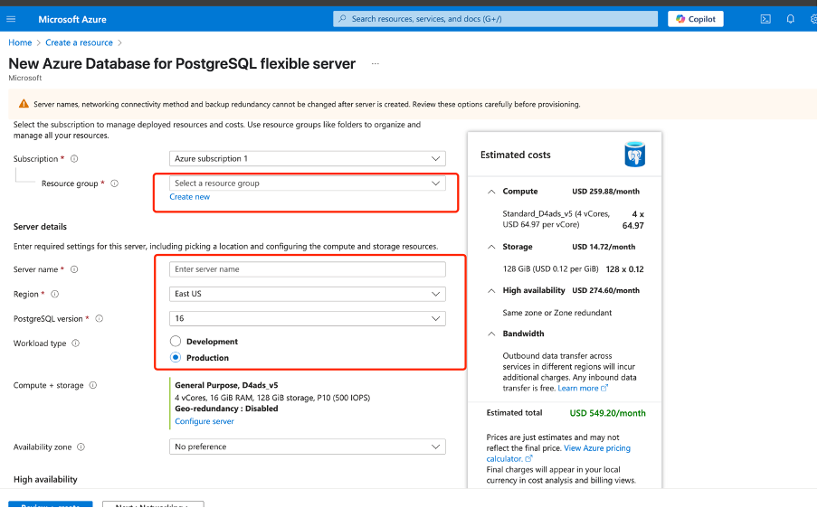
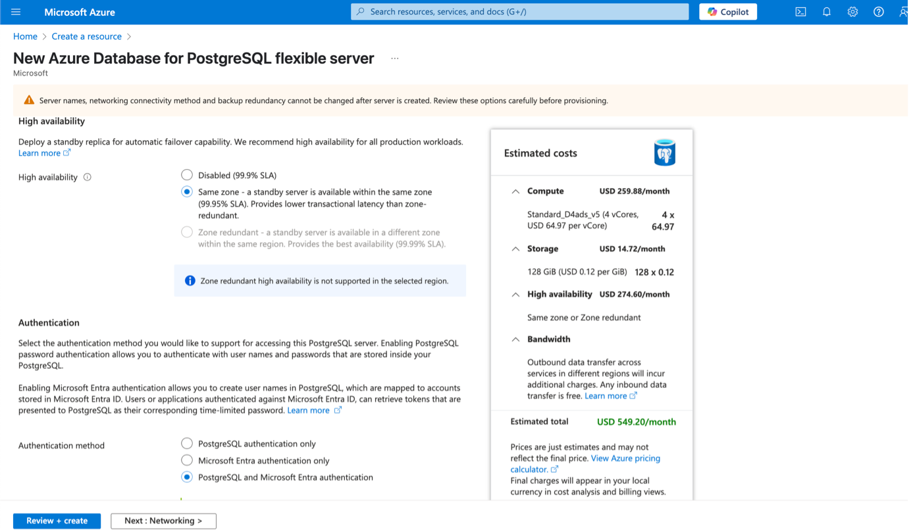
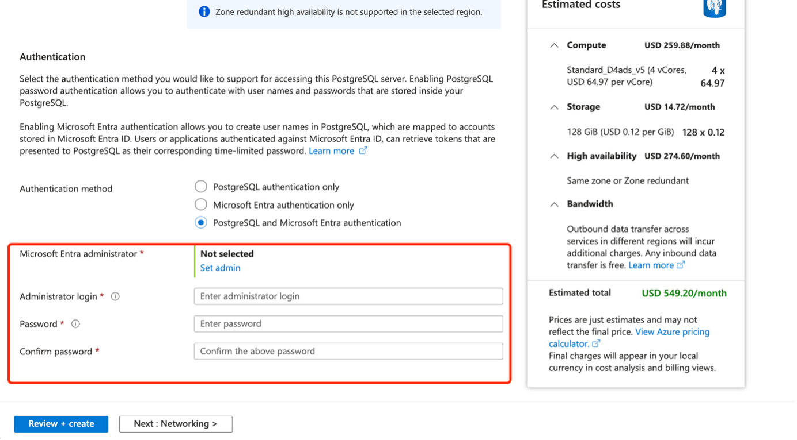
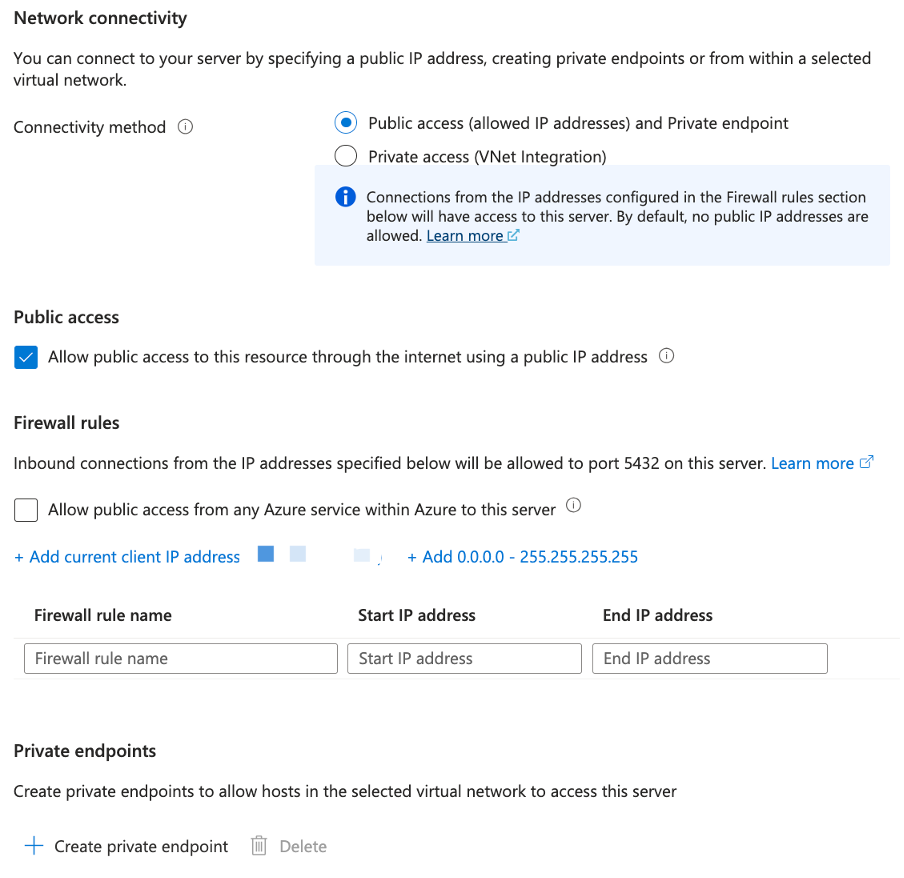
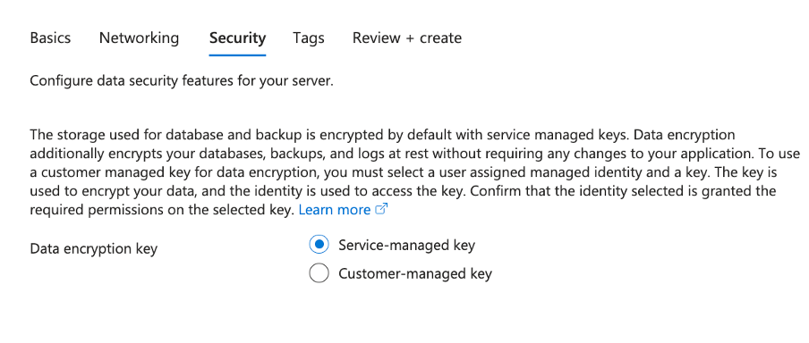
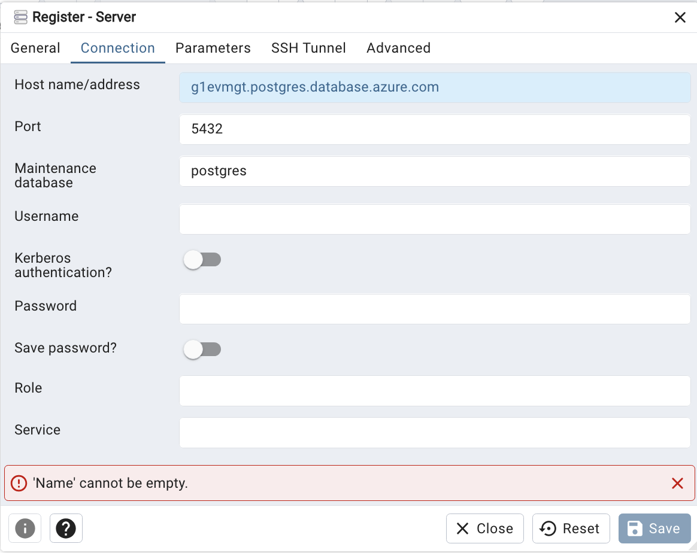
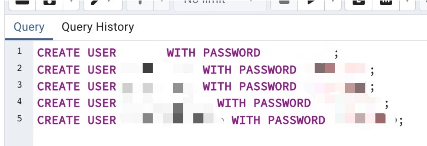

# Backend Database Server Deployment Manual

> **Purpose:** Guide developers through provisioning and configuring a PostgreSQL database on Microsoft Azure for our backend.

---

## Table of Contents

1. [Introduction](#introduction)  
2. [Prerequisites](#prerequisites)  
3. [Azure Setup](#azure-setup)  
   - [Resource Group & Subscription](#resource-group--subscription)  
   - [Provision PostgreSQL Server](#provision-postgresql-server)  
   - [Networking & Security](#networking--security)  
4. [Connection Configuration](#connection-configuration)  
   - [Connection Strings](#connection-strings)  
   - [Environment Variables](#environment-variables)  
5. [Monitoring & Alerts](#monitoring-and-alerts)  
6. [Troubleshooting](#troubleshooting)  
7. [FAQ](#faq)  
8. [References & Resources](#references--resources)  
  

---

## Introduction

This guide walks developers through standing up and managing our PostgreSQL backend on Microsoft Azure. You’ll learn how to provision an Azure Database for PostgreSQL flexible server, configure networking and security, and connect your application (or pgAdmin) using environment‑driven connection strings. Whether you’re onboarding a new teammate or spinning up a fresh dev instance, these steps ensure a consistent, secure workflow from creation through monitoring and troubleshooting.

## Prerequisites

- An Azure subscription with sufficient rights  
- Azure CLI installed (version X.X)  
- `az login` completed  
- Access to the GitHub repo  

- **pgAdmin** – GUI for PostgreSQL  
  Download the latest version for your OS from the official site:  
  https://www.pgadmin.org/download/

  Or link it inline like this:  
  [Download pgAdmin](https://www.pgadmin.org/download/)  

- Your Azure DB firewall must allow your IP (see [Networking](#networking)).


## Azure Setup


### Step 1: Basics (Create the server)

1. **Subscription & Resource Group**  
   - Subscription: select your team’s Azure subscription  
   - Resource Group: choose `eventic‑rg‑dev` or click **Create new**

2. **Server Details**  
   - **Server name:** `eventic‑db‑dev`  
   - **Region:** `East US` (pick the region closest to your users)  
   - **PostgreSQL version:** `16` (latest stable)  
   - **Workload type:** **Development** (lower cost, auto‑shutdown enabled)
   
<insert screenshot of “Basics” here>


### Step 2: Authentication

1. **Authentication method:** select **PostgreSQL and Microsoft Entra**  
2. **Administrator login:** choose a non‑generic name (e.g. `eventic_admin`)  
3. **Password:** use a strong secret, store in Key Vault or your password manager  

> You can add more Azure AD admins later under **Server → Azure AD admin**.
  



## Step 3: Networking

- **Connectivity method:** Public access + Private endpoint  
  - _Why?_ Public for initial dev; Private endpoint can be added when you move to production.
- **Allow public access:** ✓ Enabled  
- **Firewall rules:**  
  1. Click **+ Add current client IP** (your laptop’s IP)  
  2. (Optional) **Allow Azure services**  
- **Private endpoint:** Skip for now; we’ll configure this when hardening.



### Step 4: Security & Tags

- **Data encryption key:** Service‑managed (default)  
- **Tags:**  
  - `environment=dev`  
  - `project=eventic`  
- Leave all other settings as default, then click **Review + create**.




## Connection Configuration

Use pgAdmin to verify you can connect, browse schemas, and run simple queries.

### 1. Register the Server

1. In pgAdmin’s Browser pane, right‑click **Servers → Register → Server…**  
2. **General** tab  
   - **Name:** `evmgmt-azure` (anything meaningful)  
   - **Server group:** leave as “Servers” or pick your own group  

<small>)</small>

### 2. Connection Details

Switch to the **Connection** tab and enter:

| Field                 | Value                                         |
|-----------------------|-----------------------------------------------|
| Host name/address     | `g1evmgt.postgres.database.azure.com`         |
| Port                  | `5432`                                        |
| Maintenance database  | `postgres`                                    |
| Username              | `YOUR_ADMIN_USER@G1EVMGT` (all lowercase)     |
| Password              | `<Your admin password>`                       |
| SSL mode              | `Require`                                     |

<small>)</small>

Toggle **Save Password** if you want pgAdmin to remember it, then click **Save**.

### 3. Verify & Change Your Password (Optional)

1. Expand **Servers → evmgmt-azure → Databases → yourdb → Query Tool**  
2. Run:
   ```sql
   ALTER USER YOUR_ADMIN_USER WITH PASSWORD 'NewSecureP@ssw0rd!';



## monitoring  alerts
## Monitoring & Alerts {#monitoring-and-alerts}

Keep tabs on both live metrics and retained server logs so you can spot issues early.

---
<small>)</small>

### 1. Enable Server Logs

1. In the Azure portal, go to **Your‑Server → Monitoring → Server logs**  
2. Check **Capture logs for download** and set **Logs retention period** (e.g. 3 days)  
3. Click **Save**  
4. You can then **Refresh** or **Download** individual log files (e.g. error logs, postgresql logs) for deeper troubleshooting.

---

### 2. Metrics & Alerts

1. **Diagnostic Settings**  
   - Navigate to **Monitoring → Diagnostic settings → + Add diagnostic setting**  
   - Select **Metrics** (and **PostgreSQLLogs** if you like) and send to a Log Analytics workspace.

2. **Key Metrics**  
   | Metric                   | Why It Matters                   | Threshold Example     |
   |--------------------------|----------------------------------|-----------------------|
   | CPU percentage           | High CPU → slow queries          | > 80% for 5 minutes   |
   | Storage percent used     | Running out of disk → failures   | > 90%                  |
   | Active connections       | Hitting max → new connections blocked | > 75% of limit   |

3. **Alert Rules**  
   - Go to **Azure Monitor → Alerts → + New alert rule**  
   - **Scope:** your PostgreSQL server  
   - **Condition:** pick one of the above metrics & configure threshold/period  
   - **Action group:** send email or webhook to your team  
   - Give it a clear name (e.g. `dev-db-CPU-high`)

> **Tip:** For dev environments you can raise thresholds or only alert on CPU/storage to reduce noise.


## References & Resources {#references-resources}

- **Azure Database for PostgreSQL (Flexible Server) Documentation**  
  https://learn.microsoft.com/azure/postgresql/flexible-server/  

- **Terraform AzureRM Provider: PostgreSQL Flexible Server**  
  https://registry.terraform.io/providers/hashicorp/azurerm/latest/docs/resources/postgresql_flexible_server  

- **pgAdmin Official Site**  
  Download & docs: https://www.pgadmin.org/  

- **Azure Monitor Alerts & Metrics**  
  https://learn.microsoft.com/azure/azure-monitor/alerts/alerts-overview  

